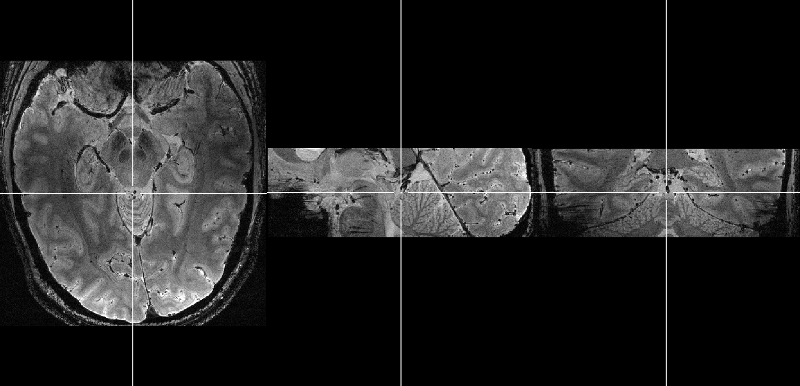
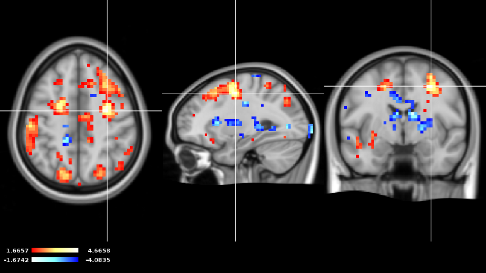

Introduction
============

This is a little introduction that aims to show you what vast is and what you can do with it.

Image types
-----------

In the first place vast is an image viewer that allows you to visualize several types of medical images. 
Those medical images can be divided into 3 groups:

* anatomical images
* functional images
* statistical maps

This is how an anatomical image might look like in vast [#f1]_:

This is how a functional image might look like in vast [#f1]_:

.. image:: _images/example_functional_image.png 
   :width: 600

This is how a statistical map might look like in vast [#f1]_:

All these three types of images can be combined arbitrarily.

File formats 
------------

| Furthermore, vast supports a list of file formats that can be loaded and/or saved. 
| A list of all supported file formats can be found in the :doc:`Technical information<techinfo>` section.

Opening vast and loading images
-------------------------------

vast can either be called on the commandline or by clicking on the respective menu-entry or desktop symbol. 
Starting vast and opening images is explained in the :doc:`Opening images with vast<openingimages>` section.

vast is extensible
------------------

| vast comes with a plugin architecture that is explained in the :doc:`Plugin-architecture<pluginarch>` section of this documentation. This allows to easily add features to vast. 
|
| As each plugin comes with a package users can individually decide which features they want and do not stand losing overview.

.. [#f1] Note that these pictures are made with the :doc:`Screenshot-function<screenshotfunction>` of vast.