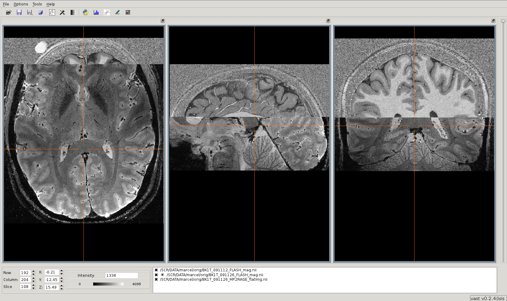
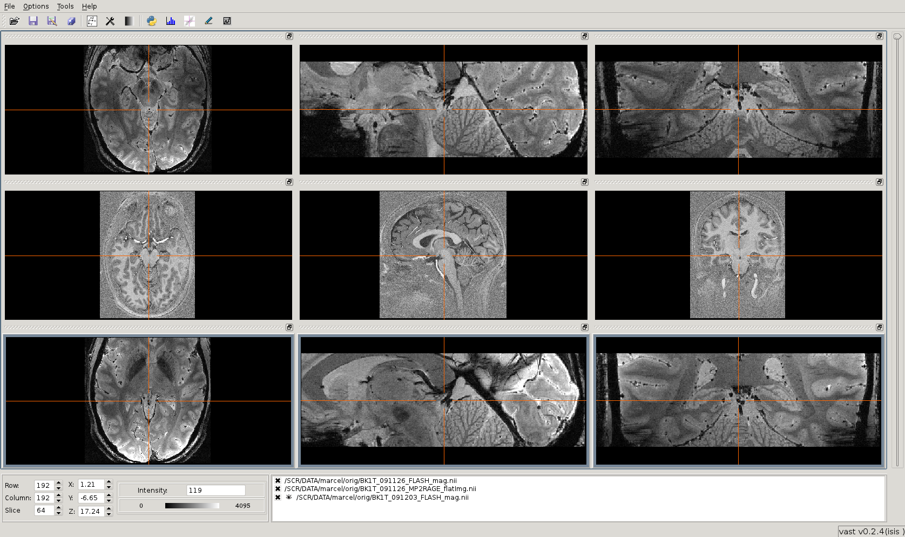

.. Opening images:

Opening images in vast
======================

There are two ways to open images with vast. It can be done by :ref:`usingterminal` or by clicking the vast symbol on the desktop or a menu-entry and :ref:`usingvastopendialog`.

.. _usingterminal:

Using a terminal
----------------

To get an overview of the commands and options you can pass to vast you can type:

   ``# vast --help``

This also gives you a list of all supported file formats. The simplest way to open vast without any images is to type:

   ``# vast``

Then you have to use the vast open dialog to load images ( :ref:`usingvastopendialog` )

Opening files
`````````````

To open simple files ( e.g. Nifti, Vista ) all you have to type is:

   ``# vast -in iamge.nii``

It is also possible to open a list of images:

   ``# vast -in image1.nii image2.v image3.nii.gz`` [#f1]_

This will open vast and load all **3** images in **1** widget-ensemble [#f2]_. So the 3 images are displayed superimposed. 




If you want to vast to display each image in one widget you simply have to type:

   ``# vast -in image1.nii image2.v image3.nii.gz -dist`` [#f1]_
   
This will open vast, load all **3** images and distribute them among **3** widget-ensembles [#f2]_. 




.. _usingvastopendialog:

Using the vast open dialog
--------------------------

.. [#f1] You can mix any file formats vast is capable of reading.
.. [#f2] A widget-ensemble is simply a set of 3 widgets (axial, sagittal and coronal).