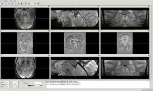
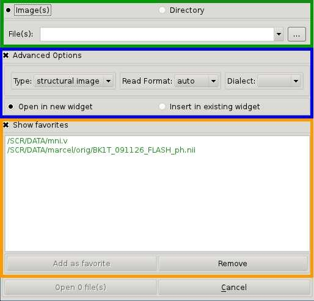
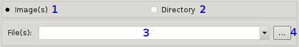
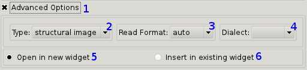

.. Opening images:

Opening images in vast
======================

There are two ways to open images with vast. It can be done by :ref:`usingterminal` or by clicking the vast symbol on the desktop or a menu-entry and :ref:`usingvastopendialog`.

.. _usingterminal:

Using a terminal
----------------

To get an overview of the commands and options you can pass to vast you can type:

   ``# vast --help``

This also gives you a list of all supported file formats. The simplest way to open vast without any images is to type:

   ``# vast``

Then you have to use the vast open dialog to load images ( :ref:`usingvastopendialog` )

Opening files
`````````````

To open simple files ( e.g. Nifti, Vista ) all you have to type is:

   ``# vast -in iamge.nii``

It is also possible to open a list of images:

   ``# vast -in image1.nii image2.v image3.nii.gz`` [#f1]_

This will open vast and load all **3** images in **1** widget-ensemble [#f2]_. So the 3 images are displayed superimposed. 

.. image:: _images/opening_images_superimposed.jpg 
   :width: 600


If you want to vast to display each image in one widget you simply have to type:

   ``# vast -in image1.nii image2.v image3.nii.gz -split`` [#f1]_
   
This will open vast, load all **3** images and distribute them among **3** widget-ensembles [#f2]_. 




.. _usingvastopendialog:

Using the vast open dialog
--------------------------

| If you are not familiar with using the terminal or just like clicking you can use the open dialog of vast. 
| It can be showed by pressing either *Ctrl+O*, *File->Open Image(s)...* or pressing the respective toolbar icon.



The above image shows the open dialog with the *basic section* (green), the *advanced option section* (blue) and the *favorites section* (orange). 
The two later ones can be hidden by clicking the respective check box buttons.

.. _basic_section:

Basic section
`````````````

First, we will take a look at the basic section which is the one you will need at each time using the open dialog.



What you have to do first is to specify whether you want to open a simple file (**1**) (in most cases you will choose this option) or a directory (**2**) (with all its containing images).
This option also influences the type of the file browse dialog which will be opened if you click *browse* button (**4**).

Then you have two options to specify the file(s) or directory want to open:

* by typing the path to the file/directory into the text field (**3**)
* choosing the file(s)/directory with a file browser (**4**)

Once specified the file(s)/directory vast will instantly check the existence and file type. If vast thinks it can not open it the path will be colored red. 
Otherwise it will be colored green.


Advanced section
````````````````


   
If you do not see the advanced section you can make it visible by clicking the check box button (**1**).

The type (**2**) denotes how vast interpretes the image it is going to load. Th choices are:

* structural image
   vast interpretes the image as a simple structural image. If not modified, the standard colortable will be used.
  
* zmap
   vast interpretes the image as a statistical image. If not modified, the standard zmap-colortable will be used. Furthermore, vast will switch to a :doc:`zmap-mode <zmap>`.


The readformat (**3**) tells vast which plugin it should use to load a file.
Usually vast regognizes the file format by the filenames suffix (e.g. .nii for Nifti files). 
Sometimes it can happen that this suffix is missing (e.g. some DICOM files lack of this suffix). 
So vast is not able to automatically detect the plugin it should use to load the file(s).
In these case the user has to specify manually which file format the image is supposed to be.


**WARNING:** dialect (**4**) is not implemented yet

| The options (**5**) and (**6**) will only be showed if you already have loaded an image(s) to vast.
| If the option *Open in new widget* (**5**) is selected vast will create a new widget-ensemble [#f2]_ and insert the image into this widget-ensemble.
| If the option *Insert in existing widget*  (**6**) is selected vast will insert into the top widget-ensemble [#f2]_.


Favorites section
`````````````````

This section gives you the capability to add/remove images you often use to have quick access to them.

.. image:: _images/open_dialog_fav_section.jpg
   :width: 600
   
If you do not see the favorites section you can make it visible by clicking the check box button (**1**).

| In the area denoted with the (**2**) you see a list of your favorite images. An entry is colored green if vast thinks it can open the image. Otherwise it will be colored red.
To open an image from that list you just have to double-click on it.

| To add a new image to the favorite list you first have to type a path pointing to the file you want to add as favorite into the text field (:ref:`basic_section` (**3**)) 
and then click the *Add as favorite*-button (**3**).

| To remove an image from the favorite-list you have mark it by clicking on it and using the *Remove*-button (**4**).

.. [#f1] You can mix any file formats vast is capable of reading.
.. [#f2] A widget-ensemble is simply a set of 3 widgets (axial, sagittal and coronal).